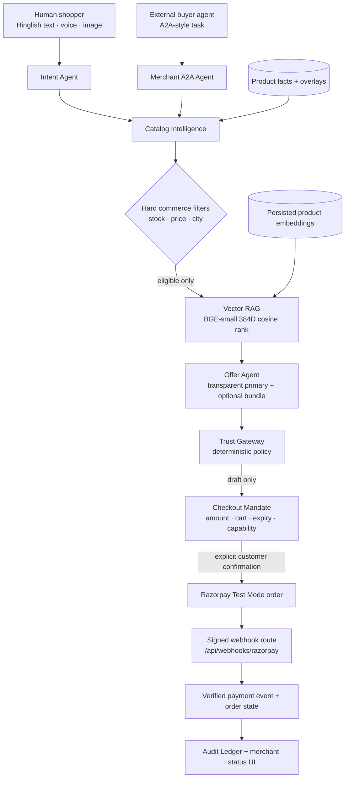

# BazaarOS Operating Guide

**Author:** Manus AI  
**Purpose:** Product, architecture, webhook, merchant-operations, and hackathon-demo guide for BazaarOS.

> **BazaarOS is an agent-ready merchant gateway.** It turns a merchant’s catalog into a grounded discovery, recommendation, quote, mandate, checkout, and audit workflow for human shoppers and external AI buyer agents.

## 1. What Is Built

| Capability | Current implementation | Why it matters |
|---|---|---|
| Provenance-backed catalog | Public-source product records are separated from Test Mode operational overlays and merchant-uploaded records | AI responses can identify source facts versus merchant-managed values |
| Hybrid RAG | Hard commerce filters run first; real Hugging Face vectors then rank eligible catalog records by cosine similarity | Semantic relevance cannot override price, stock, or delivery truth |
| Visible multi-agent flow | Intent, Catalog, Offer, A2A, Trust, Checkout, and Audit agents appear in the live mesh | The system is inspectable rather than a black-box chatbot |
| Trust Gateway | Deterministic, not LLM-controlled | Money actions are bounded and permissioned |
| Razorpay Test Mode | Mandate-gated order creation, client signature verification, signed webhook route, replay handling | The demo reaches an actual payment integration safely |
| Merchant workspace | Protected product entry, CSV preview/import, inventory update, semantic reindex, and payment-status feed | Merchant controls are easier to operate than raw APIs |

## 2. System Architecture



## 3. Retrieval and Model Decisions

The catalog uses **one complete product record as one retrieval unit**. BazaarOS does not split a product across arbitrary chunks because title, price, delivery policy, source facts, operational overlay, and provenance must remain attached to one recommendation.

| Layer | Current selection | Reason | Visible evidence |
|---|---|---|---|
| Product vectors | `BAAI/bge-small-en-v1.5`, 384 dimensions, normalized | Compact semantic encoder with a verified live Hugging Face feature-extraction route | Model, vector dimensions, query-cache result, and persisted-vector count appear in Catalog Agent output |
| Query vector | Created only after deterministic eligibility filters | Avoids paying for semantic ranking of impossible-to-buy products | Decision Intelligence receipt |
| Candidate rank | 70% cosine similarity + 30% lexical overlap + transparent style/occasion tag boosts | Semantic relevance helps natural-language search; lexical/tag features preserve inspectable reasons | Each run’s Catalog Agent trace |
| Hard constraints | Inventory, customer budget, and delivery city | These are factual eligibility rules, not preferences | Trust Gateway and Catalog Agent checklist |
| Intent extraction | Groq typed preference extraction plus deterministic parsing fallback | Adds Hinglish understanding without allowing an LLM to set price, stock, or payment policy | Intent Agent trace and Decision Intelligence panel |
| Image reference | Vision-derived visible style tags only | A reference image can influence preference, never catalog facts or payment state | Vision/OCR decision record |

Hugging Face documents feature extraction as converting text into vectors for retrieval and similarity, and supports normalized vector requests via its Inference Providers feature-extraction API. [1]

## 4. Money-Safety Contract

The assistant can never directly charge a user. It can search, rank, quote, draft a cart, and explain a recommendation. The deterministic Trust Gateway alone checks inventory, delivery, the ₹5,000 Test Mode policy cap, authority scope, expiry, idempotency capability, and explicit confirmation.

```mermaid
sequenceDiagram
    participant Shopper
    participant Agents as BazaarOS agents
    participant Trust as Trust Gateway
    participant RP as Razorpay Test Mode
    participant Audit as Audit Ledger

    Shopper->>Agents: “Black premium birthday watch under ₹2,500”
    Agents->>Trust: Proposed cart and evaluated constraints
    Trust-->>Shopper: Draft mandate only; no charge
    Shopper->>Trust: Confirm exact merchant, cart, amount, and expiry
    Trust->>RP: Create Test Mode order
    RP-->>Shopper: Checkout widget
    RP-->>Audit: Signed asynchronous webhook
    Audit-->>Shopper: Verified paid/failed status shown to merchant
```

## 5. Razorpay Webhook Setup: What You Must Do

### The current dashboard URL needs changing

The URL currently configured as `https://portfolionitij.vercel.app/` is **not** the BazaarOS server endpoint. A portfolio root will not write payment events into BazaarOS.

After you publish BazaarOS, copy its published public domain and configure this exact Test Mode URL in Razorpay:

```text
https://<your-published-bazaaros-domain>/api/webhooks/razorpay
```

For example, if the published app domain becomes `https://bazaar-os-example.manus.space`, the Razorpay webhook URL must be:

```text
https://bazaar-os-example.manus.space/api/webhooks/razorpay
```

### Razorpay Dashboard steps

| Step | Action |
|---:|---|
| 1 | Open Razorpay Dashboard and switch to **Test Mode** |
| 2 | Go to **Account & Settings → Webhooks → Add New Webhook** |
| 3 | Paste the published BazaarOS webhook endpoint shown above—not the portfolio URL |
| 4 | Keep the configured Test Mode webhook secret; it is already stored securely in BazaarOS |
| 5 | Enable `payment.captured`, `payment.failed`, and `order.paid` |
| 6 | Save, then use a Razorpay Test Mode checkout to trigger an event |
| 7 | Open **Merchant → Verified payment updates** in BazaarOS to see the signed status event |

Razorpay webhooks are server-to-server POST notifications and are distinct from a checkout `callback_url`. Razorpay recommends webhook-based automation, raw-body HMAC-SHA256 signature validation using `X-Razorpay-Signature`, and duplicate handling based on `x-razorpay-event-id`. [2] [3]

> **Important:** Do not use Live Mode keys or a Live Mode webhook secret for the hackathon demo. Do not expose any secret in frontend code, screenshots, repositories, or pitch slides.

## 6. Merchant Workspace Guide

Open **Merchant console** and sign in as the merchant owner/admin. The workspace provides three low-friction product-management routes.

| Workflow | What merchant does | What BazaarOS does |
|---|---|---|
| Add one product | Enters title, price, stock, delivery, style, and occasion | Validates mandatory commerce fields; writes provenance; creates a semantic vector |
| Bulk CSV import | Uploads a small CSV and reviews the parsed rows | Validates headers and each row before insert; imports up to 50 records per request |
| Update stock | Uses `+1` or a supported inventory control | Updates only the merchant operational overlay; invalidates catalog cache; writes audit record |
| Reindex semantic search | Clicks **Reindex semantic search** | Regenerates vectors against the current catalog document and reports failures honestly |

### CSV template

```csv
title,brand,description,imageUrl,priceInr,inventory,deliveryCities,deliveryEtaText,styleTags,occasionTags
Classic Black Leather Wallet,Nivara,Minimal full-grain leather wallet,,1299,12,Delhi,2-3 business days,"minimal,leather,black","gift,work"
```

The current CSV parser is intentionally lightweight. Keep cells simple; use commas only as list separators inside `deliveryCities`, `styleTags`, and `occasionTags`. For large production catalogs, replace this starter importer with an RFC 4180-compliant server-side parser and S3-backed import jobs.

## 7. Demo Script for the Hackathon

1. Start on the customer surface and enter: “Mujhe birthday gift ke liye black premium watch chahiye under ₹2500, Delhi delivery ke saath.”
2. Click **Run mesh**. Let all seven agents animate.
3. Open Catalog Agent and Decision Intelligence. Explain that hard constraints ran before the real vector ranker.
4. Show a candidate’s Product Provenance Card: source fact versus operational overlay are visibly separated.
5. Open Agent Mesh and run the scoped external buyer simulation. The system can return a quote but must block direct checkout.
6. Return to the customer run. Confirm the exact mandate; only then open Razorpay Test Mode.
7. Show the failure-handling demo: the system records no charge, preserves the cart, and does not retry automatically.
8. Open Merchant Workspace and show product import, vector reindex, and the verified payment-status list.

## 8. Next Production Hardening Steps

| Priority | Work |
|---:|---|
| High | Publish BazaarOS and replace the current portfolio webhook URL with the exact BazaarOS endpoint |
| High | Test `payment.captured` and `payment.failed` delivery in Razorpay Test Mode |
| High | Add merchant-specific multi-tenancy rather than the current Nivara Studio demo merchant |
| Medium | Move larger CSV imports to S3 + asynchronous job records |
| Medium | Add a true vector database when the catalog grows beyond the current compact catalog; retain hard filters before approximate nearest-neighbour retrieval |
| Medium | Add webhooks/outbox or server-sent events for immediate merchant status updates instead of the dashboard’s lightweight polling |

## References

[1]: https://huggingface.co/docs/inference-providers/tasks/feature-extraction "Hugging Face — Feature Extraction"
[2]: https://razorpay.com/docs/webhooks/ "Razorpay — About Webhooks"
[3]: https://razorpay.com/docs/webhooks/validate-test/ "Razorpay — Validate and Test Webhooks"
